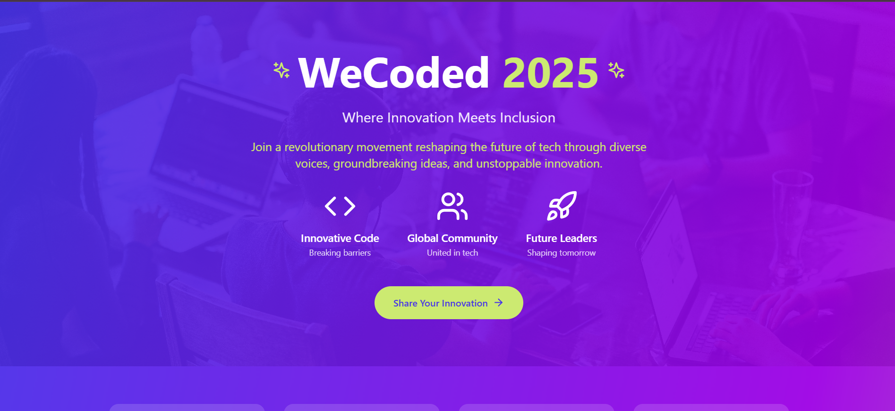

# WeCoded 2025 Landing Page

A dynamic and engaging landing page for the annual WeCoded celebration, showcasing diversity and innovation in tech. Built with React, TypeScript, and Tailwind CSS.



## 🚀 Features

- **Dynamic Content**: Real-time integration with DEV.to API to showcase WeCoded stories
- **Modern Design**: Beautiful, responsive interface with smooth animations
- **Interactive Timeline**: Visual journey through WeCoded's history
- **Impact Metrics**: Live statistics showcasing community growth
- **Story Submission**: Direct integration with DEV.to for new submissions

## 🛠️ Technologies

- React 18
- TypeScript
- Tailwind CSS
- Lucide React Icons
- Vite

## 🏃‍♂️ Getting Started

1. Clone the repository:
```bash
git clone <repository-url>
```

2. Install dependencies:
```bash
npm install
```

3. Start the development server:
```bash
npm run dev
```

4. Build for production:
```bash
npm run build
```

## 🎨 Design System

### Colors
- Primary Blue: `#4531EA`
- Accent Green: `#CCEA71`
- Secondary Purple: `#9D00E5`

### Typography
- Modern, clean typography using Tailwind's font system
- Responsive text sizing for all devices

### Components
- Interactive cards with hover effects
- Glassmorphic UI elements
- Responsive grid layouts
- Animated transitions

## 📱 Responsive Design

- Mobile-first approach
- Breakpoints:
  - Mobile: < 768px
  - Tablet: 768px - 1024px
  - Desktop: > 1024px

## 🔄 API Integration

The landing page integrates with the DEV.to API to fetch WeCoded stories:
```typescript
fetch('https://dev.to/api/articles?tag=wecoded')
  .then(response => response.json())
  .then(data => {
    // Process articles
  });
```

## 🤝 Contributing

1. Fork the repository
2. Create your feature branch (`git checkout -b feature/AmazingFeature`)
3. Commit your changes (`git commit -m 'Add some AmazingFeature'`)
4. Push to the branch (`git push origin feature/AmazingFeature`)
5. Open a Pull Request

## 📄 License

This project is licensed under the MIT License - see the [LICENSE](LICENSE) file for details.

## 🙏 Acknowledgments

- DEV.to for hosting the WeCoded celebration
- The amazing tech community for sharing their stories
- All contributors who make WeCoded possible

## 👤 Author

Shruti Adhav
- Website: [https://shruti-adhav.vercel.app/](https://shruti-adhav.vercel.app/)
- DEV.to: [https://dev.to/adhavshruti12](https://dev.to/adhavshruti12)

---

Made with 💜 for the DEV Challenges
